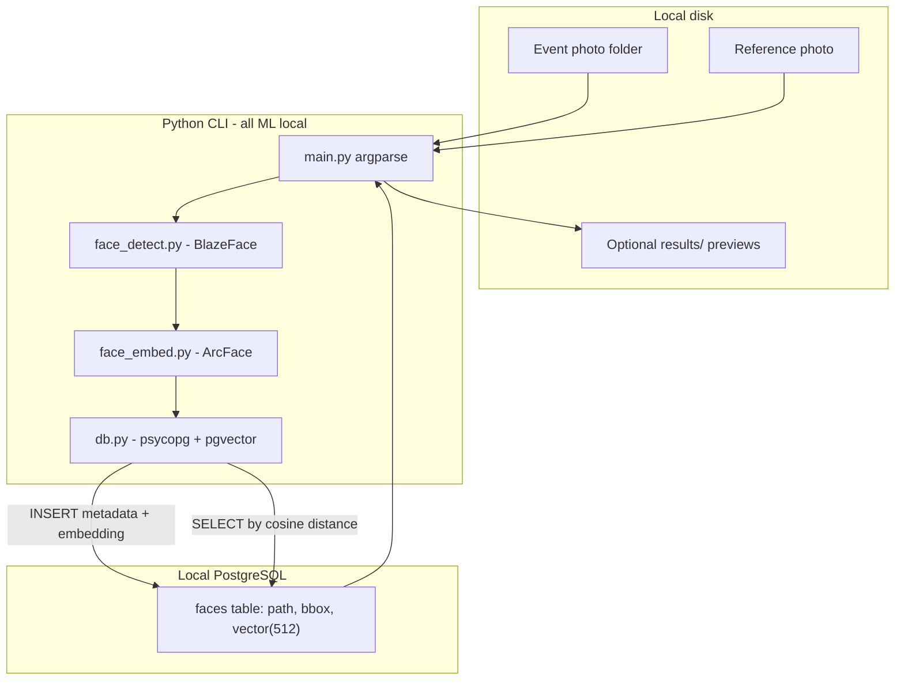

# Architecture: Local Face Search

**Read this file at the start of every session** before changing code. It is the source of truth for goals, privacy rules, stack choices, data flow, module boundaries, and what is intentionally out of scope.

Companion docs:

- [`PLAN.md`](PLAN.md) — short build checklist and implementation steps
- This file — full architecture and conventions

---

## 1. Purpose

Find photos of a **specific person** inside a folder of event photos without manually browsing every image.

Typical use:

1. **Index** a directory of event photos once (or when new photos are added).
2. **Search** with a reference photo of the person.
3. Get back a ranked list of matching **image paths** on disk.

This is a **local CLI tool**, not a hosted product. There is no web UI in v1.

---

## 2. Non-negotiable privacy rules

Personal photos are sensitive. These rules must not be violated:

| Rule | Detail |
|------|--------|
| Image processing is local | Detection and embedding run only on the user’s machine |
| Database stores no pixels | PostgreSQL never receives JPEG/PNG bytes or face crop files |
| DB stores math + pointers only | Paths/filenames, optional bbox ints, and float embedding vectors |
| Prefer local Postgres | Keep the DB on the same machine so the whole pipeline stays offline |

Search results are **paths to files that already exist locally**. Opening or displaying those files is the user’s local filesystem, not “sending images to the database.”

---

## 3. Current state vs target state

### Current state (as of 2026-07-31)

| Piece | Status |
|-------|--------|
| [`face_detect.py`](face_detect.py) | **Done:** BlazeFace → `DetectedFace` (bbox + BGR crop); relative model path |
| [`main.py`](main.py) | Temporary smoke test calling `detect_faces` on one image (not final CLI) |
| [`schema.sql`](schema.sql) + `.env.example` | **Done:** `faces` table + `DATABASE_URL` template |
| Embedding / recognition ([`face_embed.py`](face_embed.py)) | **Stub only — next** |
| `db.py` / PostgreSQL helpers | **Not implemented** |
| Index / search CLI | **Not implemented** |
| Packaging | Partial (README stub, `.gitignore`); missing `requirements.txt` / `config.py` |

**Critical distinction:** BlazeFace answers “where is a face?” It does **not** answer “who is this?” Recognition requires embeddings and similarity search.

### Target state (v1)

A working CLI that can:

```bash
python main.py index --folder /path/to/event-photos
python main.py search --image /path/to/person.jpg --threshold 0.35
```

…and return ranked matching photo paths from PostgreSQL via pgvector cosine distance.

---

## 4. High-level architecture



### Two pipelines share the same ML path

Both **index** and **search** run: image → detect faces → crop → embed → L2-normalize vector.

| Pipeline | After embedding |
|----------|-----------------|
| **Index** | Upsert vectors + metadata into `faces` |
| **Search** | Use query vector(s) in `ORDER BY embedding <=> query` and filter by similarity threshold |

---

## 5. Stack decisions (locked)

Do not casually replace these without updating this document and discussing tradeoffs.

| Layer | Choice | Why |
|-------|--------|-----|
| Face **detection** | MediaPipe Tasks `FaceDetector` + `blaze_face_full_range.tflite` | Already in [`main.py`](main.py); full-range model helps with distant faces in group/event shots |
| Face **embedding** | InsightFace ArcFace (`buffalo_l` recognition / ONNX via `onnxruntime`) | Industry-standard identity vectors; better for varied lighting/pose than MediaPipe’s lighter embedder |
| Vector store | **PostgreSQL + pgvector** | Durable SQL index of paths + vectors; cosine search in-database |
| DB install | Homebrew `postgresql` + `pgvector` on macOS | Simple local server without Docker (Docker was not available at planning time) |
| Interface | CLI (`index` / `search`) | Matches the goal with minimal surface area |
| Config | `.env` + `DATABASE_URL` | Keep secrets/connection out of source |

### Explicitly rejected for v1

| Alternative | Why not |
|-------------|---------|
| SQLite + numpy / FAISS | Simpler zero-server setup, but PostgreSQL + pgvector was chosen for a real SQL/vector stack and growth headroom |
| InsightFace for detection *and* recognition | Slightly better detector, but we keep BlazeFace as the detection path |
| `face_recognition` (dlib) | Easier tutorials; weaker accuracy and slower on event photos |
| Storing images in the DB | Violates privacy design |
| Cloud / remote DB for v1 | Prefer fully offline; embeddings-only remote would still be a later decision |

### Clarification: “Images in DB?”

**We use the database.** We do **not** store image files in it.

- **In DB:** `image_path`, `image_name`, `face_index`, bbox integers, `embedding`
- **Not in DB:** photo bytes, thumbnails, face crop JPEGs

---

## 6. Detection vs recognition


| Concept | Library / model | Output |
|---------|-----------------|--------|
| Detection | MediaPipe BlazeFace | Where faces are (boxes) |
| Embedding | InsightFace ArcFace | Who-signal as a vector |
| Matching | pgvector `<=>` (cosine distance) | Ranked similar faces |

Always L2-normalize embeddings before insert and before query so cosine distance and dot-product similarity stay consistent.

---

## 7. Data model

One photo can contain many people. Persist **one row per detected face**, not one row per image.

### Schema (target)

```sql
CREATE EXTENSION IF NOT EXISTS vector;

CREATE TABLE faces (
  id           BIGSERIAL PRIMARY KEY,
  image_path   TEXT NOT NULL,       -- stable path used for dedupe / open-on-disk
  image_name   TEXT NOT NULL,       -- basename for display
  face_index   INT  NOT NULL,       -- 0 .. n-1 within that image
  bbox_x       INT,
  bbox_y       INT,
  bbox_w       INT,
  bbox_h       INT,
  embedding    vector(512) NOT NULL, -- ArcFace buffalo_l dimension
  created_at   TIMESTAMPTZ DEFAULT now(),
  UNIQUE (image_path, face_index)
);
```

### Indexing strategy

- **v1 default:** exact search with `ORDER BY embedding <=> $query` (fine for small/medium albums, e.g. under ~5k faces).
- **Later / optional:** IVFFlat (or HNSW if available) for approximate nearest neighbor when the table grows:

```sql
CREATE INDEX faces_embedding_idx ON faces
  USING ivfflat (embedding vector_cosine_ops) WITH (lists = 100);
```

IVFFlat needs enough rows to train meaningfully; do not treat it as mandatory on day one.

### Example search SQL

```sql
SELECT image_path, image_name, face_index,
       1 - (embedding <=> %s::vector) AS similarity
FROM faces
ORDER BY embedding <=> %s::vector
LIMIT 50;
```

Application code should:

1. Filter rows below `--threshold` (or config default).
2. Collapse to **distinct photos**, keeping the **best** face score per `image_path`.
3. Print paths ranked by that best score.

---

## 8. Module responsibilities

Target layout:

```
face-recognition/
  ARCHITECTURE.md     # this file — session onboarding
  PLAN.md             # short checklist
  main.py             # CLI entry only (argparse); orchestrates modules
  face_detect.py      # BlazeFace: image path/array → list of faces (bbox + crop)
  face_embed.py       # ArcFace: face crop → L2-normalized np.ndarray (512,)
  db.py               # connect, upsert faces, search by vector
  schema.sql          # extension + table (+ optional index)
  config.py           # load env: DATABASE_URL, model paths, thresholds
  .env.example        # documented template (no secrets committed)
  requirements.txt
  README.md           # human setup guide
  blaze_face_full_range.tflite   # local model asset (gitignored)
  stored-faces/       # debug crops only (gitignored); not the search index
  results/            # optional search previews (gitignored)
```

### Contract sketches

**`face_detect.detect_faces(image_path) -> list[DetectedFace]`**

- Uses MediaPipe full-range BlazeFace.
- Returns bbox (clamped to image bounds) and optionally the BGR/RGB crop array.
- Does not talk to the database.
- Does not compute identity embeddings.

**`face_embed.embed_face(crop) -> np.ndarray`**

- Shape `(512,)`, dtype float32 (or float64 consistently), **L2-normalized**.
- Does not talk to the database.

**`db.upsert_faces(rows)` / `db.search(query_embedding, limit, threshold)`**

- Only place that opens PostgreSQL.
- Inserts metadata + vectors; never image bytes.
- Search returns ranked metadata + similarity scores.

**`main.py`**

- `index --folder ... [--reindex]`
- `search --image ... [--threshold ...] [--face-index ...]`
- Wires detect → embed → db; handles folder walking and user-facing output.

### Detection defaults (from current prototype)

Carry these into `face_detect.py` unless tuning proves otherwise:

- Model: `blaze_face_full_range.tflite` (relative path from project root, not a hardcoded absolute user path)
- `min_detection_confidence`: `0.3`
- `min_suppression_threshold`: `0.3`
- Running mode: `IMAGE`

---

## 9. CLI workflows (detailed)

### Index

```bash
python main.py index --folder /path/to/event-photos
python main.py index --folder /path/to/event-photos --reindex
```

Behavior:

1. Walk supported image extensions (e.g. `.jpg`, `.jpeg`, `.png`, `.webp`).
2. For each image: detect → embed each face → upsert `(image_path, image_name, face_index, bbox, embedding)`.
3. Without `--reindex`: skip images whose `image_path` is already fully indexed (or skip existing `(path, face_index)` rows via upsert).
4. With `--reindex`: delete/replace faces for those paths, then rewrite.
5. Log progress: files processed, faces found, errors (unreadable files, zero faces).

### Search

```bash
python main.py search --image /path/to/person.jpg
python main.py search --image /path/to/person.jpg --threshold 0.35 --face-index 0
```

Behavior:

1. Detect faces in the reference image.
2. If multiple faces: use largest box by default, or `--face-index`.
3. Embed and L2-normalize the chosen face.
4. Query pgvector; filter by threshold; distinct photos by best score.
5. Print ranked paths and scores. Optionally write debug overlays/crops under `results/` (local only, gitignored).

### Similarity threshold

ArcFace cosine similarity after L2-norm is typically tuned empirically (often roughly **0.3–0.5**). Ship a default in config; recommend the user validate with a known person from their album and adjust.

---

## 10. Configuration

Expected environment / config keys:

| Key | Purpose |
|-----|---------|
| `DATABASE_URL` | e.g. `postgresql://user@localhost:5432/face_search` |
| `BLAZEFACE_MODEL_PATH` | Path to `blaze_face_full_range.tflite` |
| `SIMILARITY_THRESHOLD` | Default search cutoff |
| InsightFace model cache | Usually under user home / insightface default; document in README |

Never commit `.env`. Provide `.env.example` with placeholders only.

---

## 11. Dependencies (planned)

| Package | Role |
|---------|------|
| `mediapipe` | BlazeFace FaceDetector |
| `opencv-python` | Image I/O and cropping |
| `numpy` | Arrays / normalization |
| `insightface` | ArcFace embedding |
| `onnxruntime` | Runs InsightFace ONNX models |
| `psycopg[binary]` | PostgreSQL client |
| `pgvector` | Vector type helpers for psycopg |
| `python-dotenv` | Load `.env` |

---

## 12. Local Postgres setup (planned)

1. Install PostgreSQL via Homebrew (e.g. `postgresql@16`).
2. Install/enable **pgvector** for that Postgres.
3. Create database `face_search` (name can vary; match `DATABASE_URL`).
4. Apply [`schema.sql`](schema.sql) (`CREATE EXTENSION vector;` + `faces` table).
5. Confirm with a trivial `SELECT` before indexing photos.

Application code should fail fast with a clear message if the extension or table is missing.

---

## 13. Git / hygiene conventions

Already or planned to be gitignored:

- `*.tflite`, Haar `*.xml` model dumps
- Sample photos (`the_office.jpg`, etc.)
- `stored-faces/`, `results/`
- `.env`

Tracked source of truth for humans/agents:

- Application Python modules
- `schema.sql`
- `requirements.txt`, `.env.example`, `README.md`
- `ARCHITECTURE.md`, `PLAN.md`

Unused in the happy path: `haarcascade_frontalface_default.xml` (legacy OpenCV cascade; detection uses MediaPipe, not Haar).

---

## 14. Error handling expectations

| Situation | Expected behavior |
|-----------|-------------------|
| Unreadable / corrupt image during index | Log and continue |
| No faces in an image during index | Log; store nothing for that file |
| No faces in search reference | Exit with clear error |
| DB unreachable / missing extension | Fail fast with setup hint |
| Multiple faces in query image | Largest face or `--face-index` |

---

## 15. Out of scope for v1

Do not implement these unless the architecture doc and plan are updated first:

- Web UI / gallery browser
- Automatic clustering or naming of people (“Person A/B”)
- Cloud-hosted database
- Real-time webcam recognition
- Mobile apps
- Storing or uploading original photos to any remote service

---

## 16. Implementation order

Follow this sequence when building (mirrors [`PLAN.md`](PLAN.md)):

1. Postgres + pgvector + `schema.sql` + `DATABASE_URL`
2. Extract BlazeFace into `face_detect.py` (relative model path)
3. Add `face_embed.py` (ArcFace, L2-normalize)
4. Implement `db.py` upsert + cosine search
5. Wire `index` / `search` CLI in `main.py`
6. Packaging: `requirements.txt`, `.env.example`, README, `.gitignore` updates

---

## 17. Session checklist for contributors and agents

Before writing code in a new session:

1. Read **this file** (`ARCHITECTURE.md`).
2. Skim [`PLAN.md`](PLAN.md) checklist for remaining work.
3. Confirm privacy rules: no image bytes in Postgres.
4. Keep detection = BlazeFace, embedding = ArcFace, store = PostgreSQL + pgvector unless explicitly changing this doc.
5. Prefer small, modular changes aligned with the module contracts above.
6. After meaningful design changes, **update this file** so the next session stays accurate.

---

## 18. Glossary

| Term | Meaning |
|------|---------|
| Bounding box / bbox | Rectangle around a detected face in image coordinates |
| Crop | Pixel region of one face cut from the photo (used in memory for embedding; not stored in DB) |
| Embedding | Fixed-length vector representing face identity |
| L2-normalize | Scale vector to unit length so cosine similarity is well-defined |
| Cosine distance (`<=>` in pgvector) | Distance used for nearest-neighbor search; similarity ≈ `1 - distance` for normalized vectors |
| Index (verb) | Process a photo folder and write face rows into Postgres |
| Search (verb) | Embed a reference face and find similar rows / photos |
