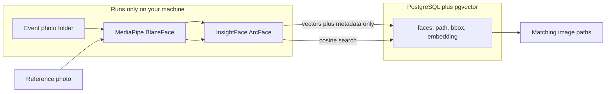

# Local Face Search with PostgreSQL

Short build checklist. For full architecture, privacy rules, module contracts, and session onboarding, read **[`ARCHITECTURE.md`](ARCHITECTURE.md)** first.

## Overview

Build a local-only face search CLI: MediaPipe BlazeFace detects faces, an ArcFace embedding model turns each face into a vector, and PostgreSQL + pgvector stores filenames/paths with embeddings (never raw images) so you can query a folder of event photos by reference face.

## Checklist

- [x] Document/install Homebrew Postgres + pgvector; add schema.sql and DATABASE_URL config
- [x] Extract MediaPipe BlazeFace detection from main.py into reusable face_detect module
- [ ] Add InsightFace ArcFace embedding pipeline (crop → L2-normalized 512-d vector)  ← **you are here**
- [ ] Implement psycopg + pgvector insert/upsert and cosine similarity search
- [ ] Build index and search CLI subcommands over an event photo folder
- [ ] Add requirements.txt, .env.example, README; update .gitignore
  - Partial: `.env.example`, stub `README.md`, and `.gitignore` exist; still missing `requirements.txt` (and later `config.py` / fuller README)

## Progress (as of 2026-07-31)

| Piece | Status | Notes |
|-------|--------|-------|
| `schema.sql` | Done | `vector` extension + `faces` table; no IVF index (correct for v1) |
| `.env` / `.env.example` | Done | `DATABASE_URL` template present; local `.env` exists (gitignored) |
| Postgres client | Available | `psql` on machine (`PostgreSQL/18`); confirm `face_search` DB + schema applied if not already |
| `face_detect.py` | Done | `DetectedFace` + `detect_faces()`; relative BlazeFace path; bbox clamp + BGR crop |
| `main.py` | Temporary smoke test | Calls `detect_faces("the_office.jpg")` — not the final CLI yet |
| `face_embed.py` | Stub only | Comment `#Arc face embedding` — **next step** |
| `db.py` | Not started | |
| `config.py` | Not started | |
| `requirements.txt` | Not started | |
| Index / search CLI | Not started | |

**Done so far:** detection is modular and matches the architecture contract (boxes + crops, no DB, no identity vectors).

**Next:** implement `face_embed.py` so each BlazeFace crop becomes an L2-normalized 512-d ArcFace vector.

## Important correction

[`main.py`](main.py) today is **face detection only** (MediaPipe BlazeFace crops faces). It cannot tell *who* a face is. Recognition/search needs a second step: **face embeddings** (fixed-length vectors) compared with cosine similarity.

We will keep BlazeFace for detection as requested, and add a dedicated embedding model for identity matching.

## Recommended architecture



### Why this stack (and what we altered)

| Choice | Decision | Reasoning |
|--------|----------|-----------|
| Detection | Keep MediaPipe BlazeFace from [`main.py`](main.py) | Already works; full-range model suits distant faces in event shots |
| Embeddings | **InsightFace ArcFace** (`buffalo_l` / recognition model via ONNX) | BlazeFace has no identity vector. ArcFace is the practical standard for “same person?” matching across lighting/pose; more reliable than MediaPipe’s lighter face embedder for event albums |
| Database | **PostgreSQL + [pgvector](https://github.com/pgvector/pgvector)** | Stores path + vector; supports cosine distance queries without shipping pixels |
| Store image pixels in DB? | **No** | DB stores filename/path, bbox, and embedding only. Photo files stay on disk |
| Interface | **CLI first** (`index` / `search`) | Fastest path to a usable local tool; no web UI required for the goal |
| Postgres install | **Homebrew Postgres + pgvector** (default) | Docker and `psql` were not on this machine at planning time; Homebrew is the simplest local path on macOS |

**Alternatives considered (not chosen for v1):**
- **SQLite + in-memory numpy/FAISS** — simpler zero-server setup; rejected in favor of PostgreSQL + pgvector for a durable SQL-queryable index and room to grow.
- **InsightFace for detection *and* recognition** — slightly better detection quality, but we keep the current BlazeFace pipeline.
- **`face_recognition` (dlib)** — easy tutorials, weaker accuracy and slower than ArcFace on varied event photos.

## Data model

One photo can contain many faces, so store **one row per detected face**, not one row per image:

```sql
CREATE EXTENSION IF NOT EXISTS vector;

CREATE TABLE faces (
  id           BIGSERIAL PRIMARY KEY,
  image_path   TEXT NOT NULL,      -- absolute or project-relative path
  image_name   TEXT NOT NULL,      -- basename for display
  face_index   INT  NOT NULL,      -- 0..n within that image
  bbox_x INT, bbox_y INT, bbox_w INT, bbox_h INT,
  embedding    vector(512) NOT NULL,  -- ArcFace dim (buffalo_l)
  created_at   TIMESTAMPTZ DEFAULT now(),
  UNIQUE (image_path, face_index)
);

CREATE INDEX faces_embedding_idx ON faces
  USING ivfflat (embedding vector_cosine_ops) WITH (lists = 100);
-- For small collections (<~5k faces), exact search without IVF is fine;
-- we can start with exact cosine ORDER BY and add IVF later if needed.
```

Privacy boundary: the DB never receives JPEG/PNG bytes—only paths you already know locally plus float vectors.

## Project layout

```
face-recognition/
  main.py                 # thin CLI entry (or replace with cli.py)
  face_detect.py          # BlazeFace detection (extracted from current main.py)
  face_embed.py           # crop → ArcFace embedding (L2-normalized)
  db.py                   # psycopg connection + insert/search helpers
  schema.sql              # pgvector schema
  config.py / .env.example  # DATABASE_URL, model paths, similarity threshold
  requirements.txt
  README.md
  PLAN.md                 # short checklist
  ARCHITECTURE.md         # full architecture — read at session start
```

## CLI workflows

1. **Index a folder**  
   `python main.py index --folder /path/to/event-photos`  
   For each image: detect faces → embed each crop → upsert `(image_path, image_name, face_index, bbox, embedding)`. Skip already-indexed paths unless `--reindex`.

2. **Search by reference photo**  
   `python main.py search --image /path/to/person.jpg --threshold 0.35`  
   Detect/embed faces in the query image (if multiple, use largest or `--face-index`). Query:

   ```sql
   SELECT image_path, image_name, face_index,
          1 - (embedding <=> %s::vector) AS similarity
   FROM faces
   ORDER BY embedding <=> %s::vector
   LIMIT 50;
   ```

   Return distinct photos ranked by best face match above threshold. Optionally write annotated preview crops under a local `results/` folder (gitignored)—still no images in Postgres.

## Implementation steps

1. **Postgres setup** — Install via Homebrew (`postgresql@16`, `pgvector`), create DB `face_search`, apply `schema.sql`. Document `DATABASE_URL` in `.env.example`.
2. **Refactor detection** — Move BlazeFace logic from [`main.py`](main.py) into `face_detect.py` with relative model path, mkdir for crops only when debugging.
3. **Add embedding** — InsightFace recognition model; L2-normalize vectors before insert/query so `<=>` is cosine distance.
4. **DB layer** — `psycopg[binary]` + pgvector types; connect from env; insert batch + search helpers.
5. **CLI** — `index` and `search` subcommands with argparse.
6. **Packaging** — `requirements.txt` (`mediapipe`, `opencv-python`, `numpy`, `insightface`, `onnxruntime`, `psycopg[binary]`, `python-dotenv`, `pgvector`), short README with setup + example commands.
7. **Hygiene** — Keep ignoring models/photos in `.gitignore`; add `.env`, `results/`; remove unused Haar cascade from the happy path (file can stay ignored locally).

## Similarity threshold note

ArcFace cosine similarity is typically tuned empirically (often ~0.3–0.5 depending on normalization). Default threshold in config; document that users should spot-check a known person once and adjust.

## Out of scope for v1

- Web UI / gallery browser
- Face clustering / auto-naming people
- Cloud or remote DB (would still only send vectors, but local Postgres keeps the whole pipeline offline)
- Real-time webcam recognition
